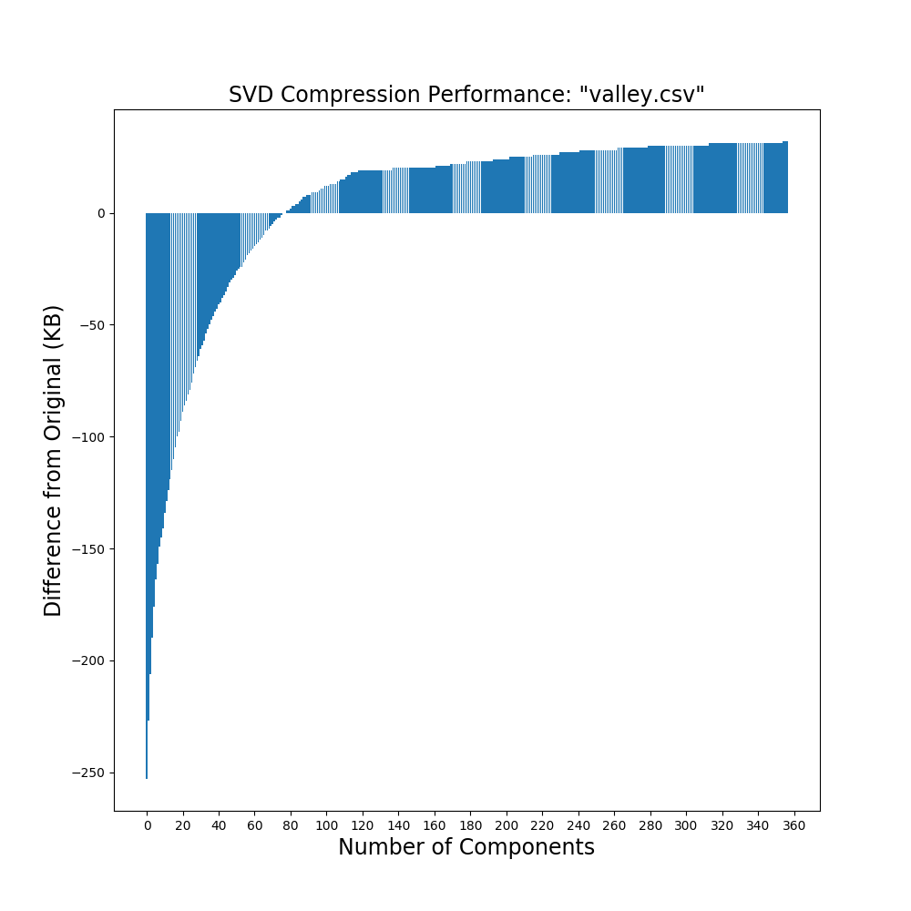

# svd-compress

## Description
Final Project for MATH 545 at UMass Amherst.

Uses Singlar Value Decomposition on an Input Image and recomposes it with a different number of components in the diagonal

Warning: The script.sh will take a few hours to run.

## Dependencies:
* numpy
* matplotlib
* pillow (Python Imaging Library)
* ffmpeg (for making animation from processed images)

## Documentation

#### Process valley.jpg in steps of 1 upto 360 components:

`python3 compress.py stock/valley.jpg 360 1`

#### Make animation from these processed images: (only works if stepsize is 1)

`ffmpeg -framerate 24 -i processed%00d.png -c:v libx264 -profile:v high -crf 2 -preset veryslow -pix_fmt yuv420p valley.mp4`

#### Make csv data file from output image:

`python3 sort.py valley`

#### Make graphs from data:

`python3 data_analysis.py data/valley.csv 0 361 20`

